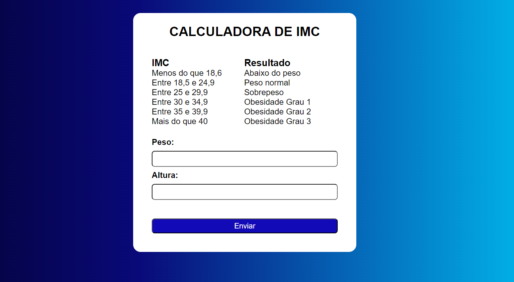

# Calculadora de IMC

Este projeto é uma simples calculadora de IMC (Índice de Massa Corporal) desenvolvida com HTML, CSS e JavaScript. O usuário pode inserir seu peso e altura, e o programa calculará e exibirá o resultado.

## Acesse o Projeto

Você pode usar a calculadora diretamente [neste link](https://diogograebin.github.io/calculadoraIMC/).

## Tecnologias Utilizadas

- HTML
- CSS
- JavaScript

## Como Usar

1. Acesse o link do projeto.
2. Insira seu peso (em kg) e altura (em metros) nos campos apropriados.
3. Clique no botão "Calcular" para obter o seu IMC.
4. O resultado será exibido abaixo do formulário.

## Exemplo de Tela

## Contribuição

Sinta-se à vontade para fazer um fork deste repositório e enviar pull requests. Sugestões e melhorias são sempre bem-vindas!

